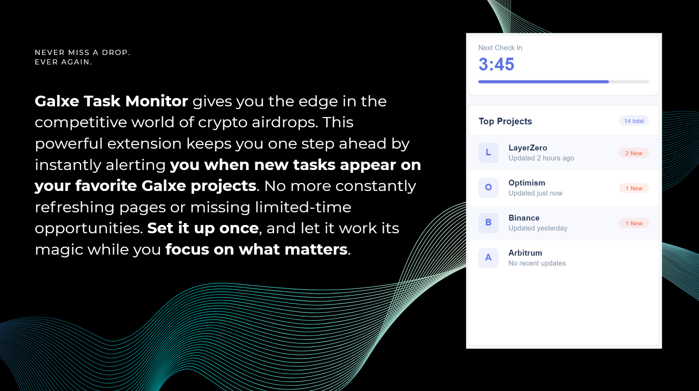
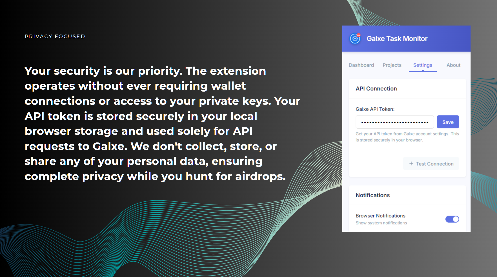

<h1 align="center">
🚀 Galxe Task Monitor Extension
</h1>

A lightweight and privacy-focused Chrome Extension that notifies you about <b>new Galxe tasks</b> — ideal for <i>crypto airdrop hunters</i> who never want to miss a quest again.

---

## 🧠 What It Does

A Chrome Extension that connects to Galxe's official GraphQL API to monitor selected projects (Spaces) and alerts users via browser notifications when new tasks are added.

---

## ✨ Features

- 🔍 **Galxe API Integration**  
  Connects directly to Galxe's GraphQL API (`https://graphigo.prd.galaxy.eco`) to monitor quests

- 🎯 **Targeted Project Tracking**  
  You choose which **Galxe Spaces** (projects) to follow

- 🔔 **Browser Notifications**  
  Alerts you the moment a new task is added

- 🧩 **Badge Indicator**  
  Displays "NEW" on the extension icon when updates are available

- 🔐 **Wallet-Free**  
  No wallet connection required — 100% read-only

- 🔒 **Secure & Private**  
  API token stored locally. No data is sent to any server (more below 👇)

---

## 🛠️ Installation

### 🌍 Chrome Web Store (Recommended for Public Use)

> 🔔 For end users, the extension should be [published on the Chrome Web Store](https://chrome.google.com/webstore/) for easy updates and installation.  

---

## ⚙️ Setup Instructions

1. **Get Your Galxe API Token**  
   - Log in to [Galxe](https://galxe.com)  
   - Go to your Account Settings  
   - Copy your **access-token**

2. **Configure Extension**  
   - Click the extension icon  
   - Open Settings  
   - Paste your token and save

3. **Add Projects (Spaces)**  
   - Enter project aliases (e.g., `binance`, `layerzero`)  
   - Click **Add**

That's it! The extension will check for new tasks every 5 minutes and notify you instantly.

---

## 🔐 Privacy & Security

We take your security seriously:

- ✅ No wallet connection  
- ✅ No access to private keys  
- ✅ No external tracking  
- ✅ No data sent to our servers  
- ✅ Everything is stored **locally in your browser**

Only your Galxe `access-token` and project list are saved in `chrome.storage.local`.  
All interactions are made directly with the official Galxe API.

---

## 🧪 How It Works

- Polls Galxe every **5 minutes**
- Tracks your selected projects for quest updates
- Checks task `credential.id` and `lastUpdate` timestamps
- Sends browser notifications and updates badge when new tasks are found

You can view updates by clicking the icon or notification, which opens the corresponding Galxe quest.

---

## 🧰 Developer Info

- 💻 GitHub (Main): [@xPOURY4](https://github.com/xPOURY4)  
- 🛠️ GitHub (Team): [HexQuant-hub](https://github.com/HexQuant-hub)  
- 🐦 Twitter: [@therealpourya](https://x.com/therealpourya)

---

## ❓ FAQ

> **Q: Does this extension connect to my wallet?**  
> A: No. It is 100% read-only and never asks for wallet access.

> **Q: Where is my data stored?**  
> A: In your browser’s local storage — never sent to a server.

> **Q: Can I use this on mobile?**  
> A: No. Chrome Extensions currently only work on desktop browsers.

---

## 📜 License

This project is licensed under the **MIT License**.  
See [LICENSE](./LICENSE) for details.

---

## 📄 Privacy Policy

You can read the full privacy policy here:  
👉 [PRIVACY-POLICY.md](https://github.com/xPOURY4/Galxe-Task-Monitor/blob/main/blob/main/PRIVACY-POLICY.md)

---

## 🙏 Disclaimer

This project is not affiliated with Galxe.  
It is an independent open-source tool developed by the community, for the community.

---

✨ Made with love by crypto builders ✨

